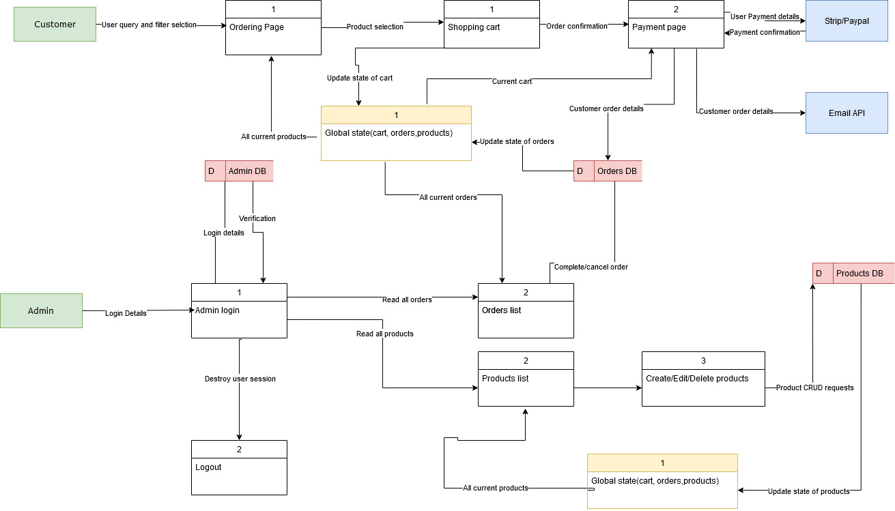
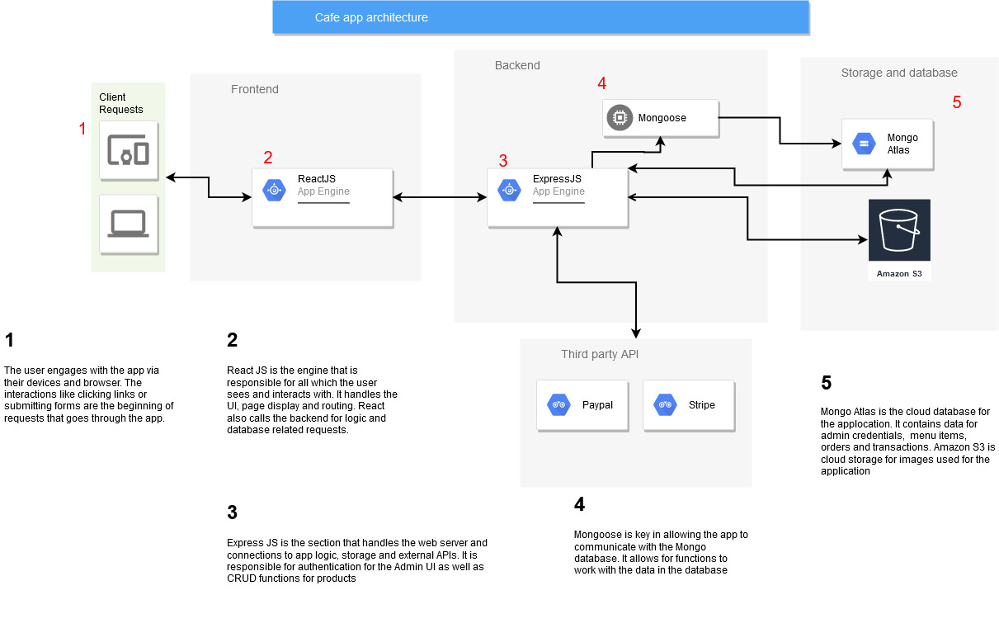

# Mern-project-part-A

Joint project By Alex Qiang and Lachlan Reynolds

## Description

### Purpose

As Australia enters a covid-normal environment, the restaurant industry has to adapt to continue to succeed. It is essential that a business has online ordering click and collect capabilities. This application makes ordering at cafe XYZ an easy and fast online affair. We also seek to makes it easy for the business operator to interact with the website content and data. This web app will provide a seamless experience for customers to engage with and be a powerful business and marketing platform for restaurant operators. 

### Functionality / features

- Content management system (Admin UI)
  - Image upload 
  - Transaction management
  - Products Management(CRUD)
  - Authentication/AUthorisation
  - The application contains an admin ui for business operators to edit and manipulate content without touching code. It will support admin authentication which direct user to dashboard. The dashboard has image upload for gallery carousel and menu, tab to manage incoming orders and create, edit and deleting of menu items. 
  
- Payment system (Stripe and Paypal API)
  - Allows for ordering and payment from within the application 
  - Allows customer to use Paypal or credit/debit card for payment 
  - Transaction is sent to Admin UI
  
- Online ordering
  - View list of menu items, grouped by categories
  - Filterable dietary requirements
  - Cart functionality
  - Pick collection time
  

#### Nice to have feature
- Google analytics 
- Maps API 
- Search function for ordering

### Target audience

- Young people, professionals and families that want to save time by ordering online. 
- Enjoy freshly baked goods and well prepared meals using fresh ingredients.
- Dislikes frustrating meal experiences
- Dislikes bland meals
  

### Tech stack

#### App

- MongoDB
- ExpressJS
- React
- NodeJS
  
#### CMS

- KeystoneJS
  
#### Deployment

- Heroku (backend) 
- Netlify (frontend) 
  
### Wireframes and Diagrams

- Adobe Xd
- Balsamiq
- Lucid Charts/diagrams.net
  
### Styling

- SCSS
- Bootstrap

### Image Upload

- AWS S3

## Dataflow Diagram

## Application Architecture Diagram

## User Stories

### Content management system (Admin UI)

Julie is the owner of cafe XYZ for 6 years now. Recent time it has become very clear to her that an online presence and service is crucial for business operations and growth. She wants to bring her products to more customers and at the same time reduce crowding at the establishment

- As an admin(Julie) I want to be able to 
  - see and edit all website content from one place, so it is easier to manage
  - quickly add, edit and remove menu items so the website will be up to date
  - see orders that are coming through so I can sent the orders to the kitchen
  - upload pictures for the menu items so the products seem more appetising

### Payment system (Stripe and Paypal API)

Jeff is a student at University B studying law. He is a big fan of his local cafe XYZ and wants to support them during current times of covid. He is quite time constrained and want to breeze through the payment process and then pick up his order. 

- As a customer(Jeff) I want to be able to
  - add wanted products into a cart so it can be ready for purchase
  - use Paypal for the transaction as it is a popular service for payment
  - send the receipt to my email so I can have a proof of purchase

### Online ordering 

Liz is an accountant and is mother to 2 children. She is a very busy woman but makes time to focus on food and nutrition for herself and family. She recently found a local cafe named XYZ online and is interested in their offerings.

- As a customer(Liz) I want to be able to
  - contact the business on website so I can easily send some inquiries
  - browse through a menu quickly so I can expeditiously make my decision 
  - filter the ordering selections so I can browse items that fit my dietary requirement
  - Add special requests upon checkout so I fulfil my culinary experience
  - choose when I come to collect my order so I can pick up my food when I'm ready
  

## Wireframes

### Mobile

### Tablet

### Desktop

## Screenshots